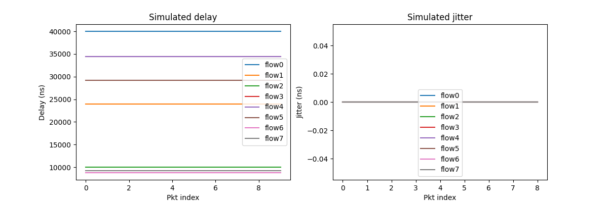

<!--
Author: <Chuanyu> (skewcy@gmail.com)
quickstarted.md (c) 2023
Desc: description
Created:  2023-11-28T20:50:32.963Z
-->

# Getting started

## Installation

Install from source (recommended):

```
git clone https://github.com/ChuanyuXue/tsnkit
cd tsnkit
pip install -r requirements.txt
```

From pip: 

```
pip install -U tsnkit
```

*Note: Currently, the pip version might be behind in updates compared to the source installation, so it's recommended to install from source for the latest features.*

## Example Usage:

Follow these steps for a basic use case: 

1. **Generate Input Data:** Run the script `data/generator.py` to create a random stream set and network description. Following command uses the default arguments:

    ```
    python3 -m tsnkit.data.generator
    ```

    This generates `1_task.csv` (streamset) and 1_topo.csv (topology) in the current directory, along with dataset_logs.csv which logs the details of each streamset/topology. The detailed format of these files can be found in [next section](dataprep.md).

2. **Run the Scheduling Algorithm:** Execute the scheduling algorithm using the generated input:

    ```
    python3 -m tsnkit.algorithms.ls 1_task.csv 1_topo.csv 
    ``` 

    Here, `algorithms.ls`` represents one of the available scheduling algorithms. For more options, see [section algorithms](schedule.md). The output log displays results, execution time (in seconds), and memory usage (in KB):


    ```
    | time          | name   | flag   | solve_time | total_time | total_mem
    | 19~14:48:54   | -      | succ   | 0.001      | 1.758      | 77072.0 
    ```

    The flag can be `succ` (successful scheduling), `fail` (scheduling failed), or `unknown` (algorithm terminated due to time/memory constraints).

3. If the result is succ, four configuration files are generated, each distinguished by its suffix:


   -  --GCL.csv: Gate Control List for each network bridge.
   -  --OFFSET.csv: Release time for each flow at the end-station.
   -  --QUEUE.csv: Queue assignments for each flow at each hop.
   -  --ROUTE.csv: Routing paths for each flow.
   
   File formats are detailed in [next section](dataprep.md).

4. Use the following script to validate the generated configurations:

    ```
    python3 -m tsnkit.simulation.tas ./1_task.csv ./
    ```

    During the runtime, the script outputs logs as following to show the forwarding time of each packet on each hop:

    ```
    [Listener 11]:      Flow 3 - Receive at 8012600
    [Bridge (3, 2)]:    Flow 0 - Arrive at 8012600
    [Bridge (2, 1)]:    Flow 0 - Arrive at 8015400
    [Listener 12]:      Flow 7 - Receive at 8015400
    [Bridge (1, 0)]:    Flow 0 - Arrive at 8018200
    [Bridge (0, 8)]:    Flow 0 - Arrive at 8021000
    [Listener 8]:       Flow 0 - Receive at 8023800
    ```

    The final log indicates any potential errors and the send/receive times for each flow:

    ``` 
    # This line shows the potential errors during simulation. Empty means no potential error detected.
    [Potential Errors]: []

    # This line shows the sending and receiving time of each flow.
    [[[1400, 2001400, 4001400, 6001400, 8001400], [23800, 2023800, 4023800, 6023800, 8023800]],..., [15400, 2015400, 4015400, 6015400, 8015400]]]
    ```

    The script also draws statistics for each flow, including delay and jitter.

    

## Dependency

1. **Gurobi**

   Algorithms that require Gurobi: i_ilp, jrs_mc, jrs_nw, jrs_wa, smt_nw

   **Installation:**

   The limited version of gurobi should already be installed with your installation of tsnkit. If not, use the following command to install it:
   ```
   pip install gurobipy
   ```
    The limited version can solve models with a maximum of 2000 variables and 2000 constraints. Models that exceed these limits require an academic license that can be installed through the following steps.
   
    1. Register for a Gurobi account and download the Gurobi Optimizer [here](https://www.gurobi.com/downloads/gurobi-software/).
    2. Request a web license service under the tab labeled WLS Academic [here](https://portal.gurobi.com/iam/licenses/request/). This step must be completed while connected to a university network.
    3. After obtaining a license, follow the steps provided by [this link](https://license.gurobi.com/manager/doc/overview/#optimizer) to start using the Gurobi Optimizer.

  
3. **CPLEX CP Optimizer**

   Algorithms that require CPLEX CP Optimizer: cp_wa, jrs_nw_l

   **Installation:**

   Installing `docplex` only provides the Python API wrapper. You need IBM CPLEX Optimization Studio (includes CP Optimizer executable) installed:
   
    1. Go to [IBM Academic Initiative](https://www.ibm.com/academic/) and register for academic access.
    2. After approval, download and install **CPLEX Optimization Studio**.
    3. Install the Python API: `pip install docplex`
  
    _Note: Academic version currently only supports Python versions 3.10. You may need to change their setup.py to support other versions._
